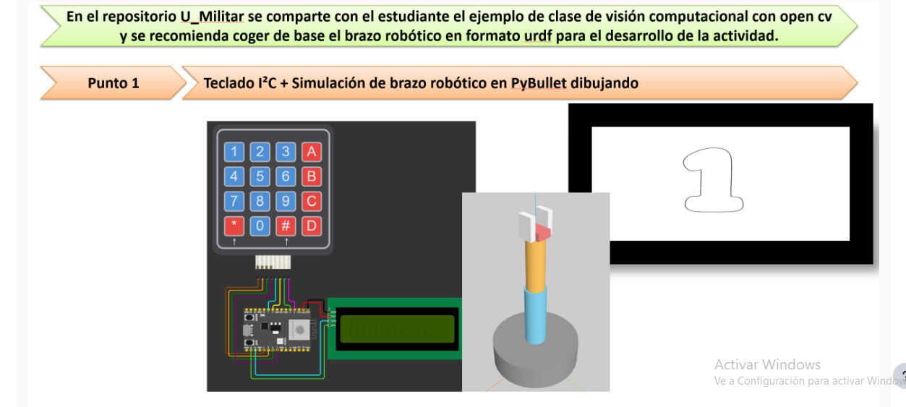
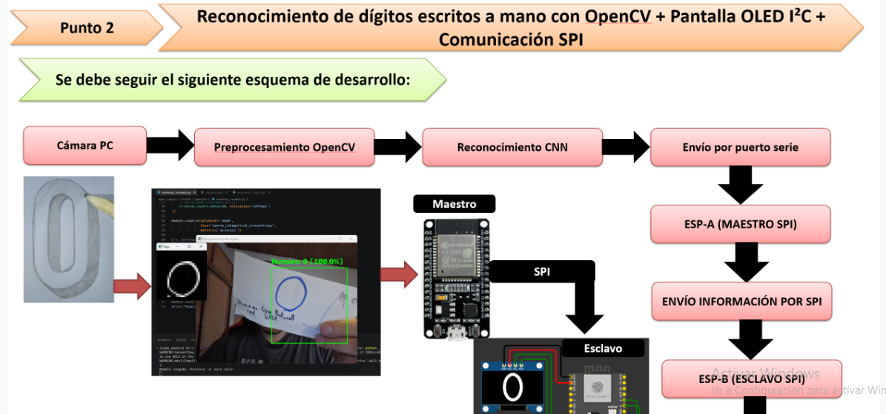
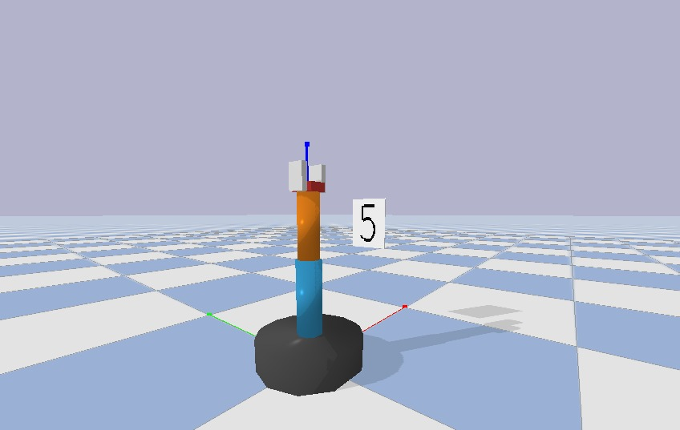

# Actividad 6 – Teclado, brazo en PyBullet y reconocimiento de dígitos con OpenCV + SPI

**Asignatura:** Micros – Universidad Militar Nueva Granada

Esta actividad tiene dos puntos:

1. **Teclado + pantalla I²C + brazo robótico en PyBullet dibujando** el número oprimido.
2. **Reconocimiento de dígitos escritos a mano** con OpenCV y una CNN, enviados por serial a una ESP32 maestra SPI que los pasa a una ESP32 esclava que los muestra en una OLED I²C.

Se usó como base el brazo `brazo.urdf` y los ejemplos de OpenCV del repositorio del curso ([dialejobv/U_Militar](https://github.com/dialejobv/U_Militar)).

| Enunciado Punto 1 | Enunciado Punto 2 |
|---|---|
|  |  |

---

## Punto 1 – Teclado + pantalla I²C + brazo dibujando en PyBullet

```
Teclado 4x4 ──► ESP32 ──USB serial──► Python (main.py) ──► PyBullet (brazo.urdf)
                  │  ▲                       │
           Pantalla I²C └──── estado ◄───────┘
```

### Hardware

| Elemento | Conexión a la ESP32 |
|---|---|
| Teclado 4×4, filas R1–R4 | GPIO 13, 14, 27, 26 |
| Teclado 4×4, columnas C1–C4 | GPIO 25, 33, 32, 4 |
| OLED SSD1306 0.96" I²C (0x3C) – usada en las pruebas | SDA = GPIO 21, SCL = GPIO 22, VCC = 3.3 V, GND |
| *Alternativa:* LCD 16×2 con módulo I²C (0x27) | SDA = GPIO 21, SCL = GPIO 22, VCC = 5 V, GND (usar `teclado_lcd.ino`) |

### Cómo funciona

**Firmware (`punto1_teclado_pybullet/firmware/teclado_oled`, o `teclado_lcd` si se usa LCD)**
- Lee el teclado con la librería `Keypad`, muestra la tecla en la pantalla y la envía por serial (`5\n`).
- Lo que reciba por serial desde el PC (`Dibujando: 5`, `Listo`) lo muestra en la parte inferior de la pantalla.

**Python (`punto1_teclado_pybullet/python`)**
- `main.py` lee la tecla del puerto serial. Con un dígito del 0 al 9 el brazo lo dibuja, y con `#` borra el dibujo. Las demás teclas se ignoran.
- `digitos.py` define cada dígito como uno o varios trazos (polilíneas y arcos) en un cuadro de 1×1.
- El brazo (`brazo.urdf`) tiene tres grados de libertad útiles: `joint_1` (giro de la base), `joint_2` (inclinación del brazo) y `joint_gripper` (prismática, extiende la pinza a lo largo del brazo).
- El lienzo es un plano vertical a 0.48 m de la base. Para cada punto del trazo `(y, z)` se calcula la cinemática inversa en forma cerrada:
  - `joint_1 = atan2(y, D)`
  - `joint_2 = atan2(√(D² + y²), z − z_joint2)`
  - `joint_gripper = distancia a la punta − alcance base`
  
  Como la pinza se extiende, la punta sí alcanza un plano y no solo una esfera.
- **Pluma arriba/abajo:** la pinza se retrae 3 cm para desplazarse sin escribir y se extiende hasta el plano para dibujar. El trazo se pinta en PyBullet con `addUserDebugLine` siguiendo la posición real de la punta (cinemática directa).
- Los segmentos largos se subdividen cada 6 mm para que las líneas rectas queden rectas.

### Cómo ejecutarlo
1. Subir `teclado_oled.ino` a la ESP32 (librerías: **Keypad**, **Adafruit SSD1306** y **Adafruit GFX**). Para LCD usar `teclado_lcd.ino` con **LiquidCrystal_I2C**.
2. Instalar dependencias y ejecutar:
   ```bash
   cd punto1_teclado_pybullet/python
   pip install -r requirements.txt
   python main.py --puerto COM5
   ```
3. Sin ESP32 se puede probar escribiendo las teclas en la terminal: `python main.py --sin-serial`.

---

## Punto 2 – Dígitos escritos a mano: OpenCV + CNN + SPI + OLED I²C

```
Cámara PC → Preproceso OpenCV → CNN (MNIST) → Serial USB → ESP-A (maestro SPI)
                                                                  │ SPI
                                                                  ▼
                                                  ESP-B (esclavo SPI) → OLED I²C
```

### Hardware

**Conexión SPI entre las dos ESP32 (VSPI)**

| Señal | ESP-A (maestro) | ESP-B (esclavo) |
|---|---|---|
| SCK  | GPIO 18 | GPIO 18 |
| MISO | GPIO 19 | GPIO 19 |
| MOSI | GPIO 23 | GPIO 23 |
| SS / CS | GPIO 5 | GPIO 5 |
| GND  | GND | GND (común) |

**OLED SSD1306 128×64 (I²C, 0x3C) en la ESP-B:** SDA = GPIO 21, SCL = GPIO 22, VCC = 3.3 V, GND.

### Cómo funciona

**Python (`punto2_digitos_spi/python`)**
- `entrenar_modelo.py` entrena una CNN (2 capas convolucionales + densa) sobre MNIST con aumento de datos y guarda `modelo_mnist_cnn.h5`. Se ejecuta una sola vez; el modelo entrenado ya está incluido.
- `main.py`:
  1. Captura la cámara y recorta una zona de interés (recuadro verde).
  2. Preprocesa: escala de grises → desenfoque gaussiano → umbral adaptativo → contorno más grande → recorte → 20×20 centrado por centro de masa en un lienzo de 28×28, como MNIST.
  3. La CNN predice el dígito y se suaviza con votación mayoritaria sobre los últimos 5 cuadros.
  4. Cuando un dígito se mantiene estable (≥ 4 de 5 cuadros, confianza > 60 %) y es distinto del último enviado, se manda por serial como `dígito,confianza` (por ejemplo `7,98`). Si la zona queda vacía unos cuadros, se permite volver a enviar el mismo dígito.
- Cambios respecto al ejemplo del curso: envío serial y recorte de la zona antes de dibujar el recuadro. Antes el borde verde entraba en la imagen analizada y, con la zona vacía, se leía como un "0".
- Funciona mejor con trazos delgados (lápiz o marcador fino, unos 6–8 px en pantalla). Con trazos muy gruesos el umbral adaptativo deja solo el contorno.

**ESP-A (`firmware/esp_a_maestro`)**
- Recibe `dígito,confianza` por USB y envía 4 bytes por SPI a 1 MHz, modo 0: `0xA5, dígito, confianza, 0x5A`.

**ESP-B (`firmware/esp_b_esclavo`)**
- Usa el driver `spi_slave` del ESP-IDF (incluido en el core de ESP32, sin librerías externas), recibe los 4 bytes, valida las marcas de inicio y fin y muestra el dígito grande y la confianza en la OLED.

### Cómo ejecutarlo
1. Subir `esp_a_maestro.ino` a la ESP-A y `esp_b_esclavo.ino` a la ESP-B (librerías: **Adafruit SSD1306** y **Adafruit GFX**).
2. Cablear las dos ESP32 según la tabla y conectar la ESP-A al PC por USB.
3. Ejecutar:
   ```bash
   cd punto2_digitos_spi/python
   pip install -r requirements.txt
   python main.py
   ```
   Editar `PUERTO_SERIAL` en `main.py` con el puerto de la ESP-A. Se recomienda Python 3.11 (TensorFlow no soporta versiones muy recientes). Pulsar `q` para salir.

---

## Evidencias

### Punto 1 – Teclado + brazo en PyBullet



- Captura: [`Evidencia1_captura_pybullet.jpg`](evidencias/punto1/Evidencia1_captura_pybullet.jpg)
- Video: [`Evidencia2_teclado_pybullet.mp4`](evidencias/punto1/Evidencia2_teclado_pybullet.mp4)

### Punto 2 – Reconocimiento de dígitos + SPI + OLED

- Video (pantalla del PC, cámara y reconocimiento): [`Evidencia3_reconocimiento_camara.mp4`](evidencias/punto2/Evidencia3_reconocimiento_camara.mp4)
- Video (montaje de las dos ESP32 y la OLED): [`Evidencia4_montaje_spi_oled.mp4`](evidencias/punto2/Evidencia4_montaje_spi_oled.mp4)

> En el Punto 1 se usó una pantalla OLED I²C en lugar del LCD 16×2 mostrado en el enunciado, porque no se contaba con el LCD.

## Entorno de Python

Se usó un entorno de conda con Python 3.11:
```bash
conda create -n micros python=3.11 -y
conda activate micros
conda install -c conda-forge pybullet -y
pip install pyserial tensorflow opencv-python numpy
```

## Estructura del repositorio

```
.
├── README.md
├── docs/                              enunciado de la actividad
├── evidencias/
│   ├── punto1/   (captura y video)
│   └── punto2/   (2 videos)
├── punto1_teclado_pybullet/
│   ├── firmware/ (teclado_oled/teclado_oled.ino, teclado_lcd/teclado_lcd.ino)
│   └── python/ (main.py, digitos.py, brazo.urdf, requirements.txt)
└── punto2_digitos_spi/
    ├── firmware/
    │   ├── esp_a_maestro/esp_a_maestro.ino
    │   └── esp_b_esclavo/esp_b_esclavo.ino
    └── python/ (main.py, entrenar_modelo.py, modelo_mnist_cnn.h5, requirements.txt)
```

## Referencias
- [Repositorio del curso (U_Militar)](https://github.com/dialejobv/U_Militar)
- [ESP-IDF – SPI Slave Driver](https://docs.espressif.com/projects/esp-idf/en/latest/esp32/api-reference/peripherals/spi_slave.html)
